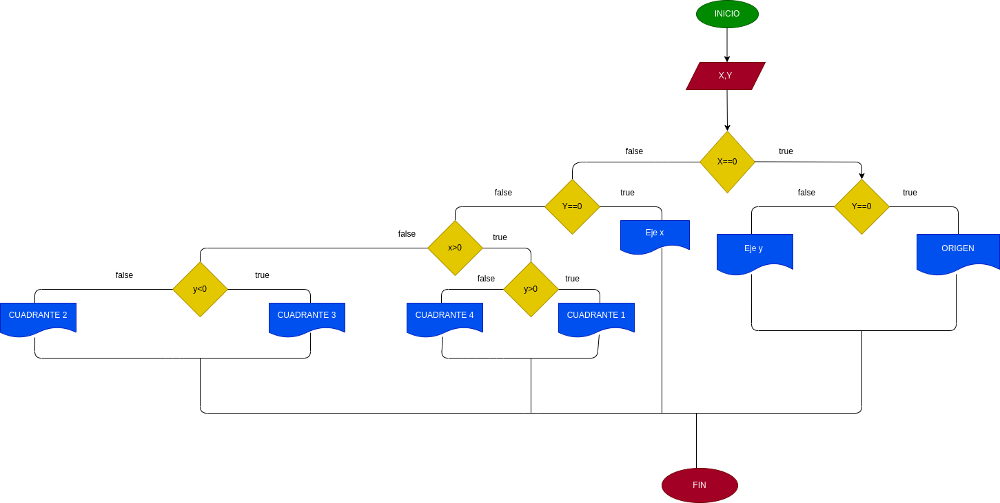

# Coordenadas_Cartesianas
Programa que lee las coordenadas cartesianas (x, y) de un punto en el plano y calcula el cuadrante al cual pertenece el punto. Si el punto está sobre un eje también debe indicarlo.

# ANALISIs

Variables de entrada y proceso (input, processing)

X,Y: Coordenadas del punto

Variables de salida

Eje x
Eje y
Origen
Cuadrante 1
Cuadrante 2
Cuadrante 3
Cuadrante 4

Nos indicara el punto exacto en el plano cartesiano

# DISEÑO

# CONSTRUCCION