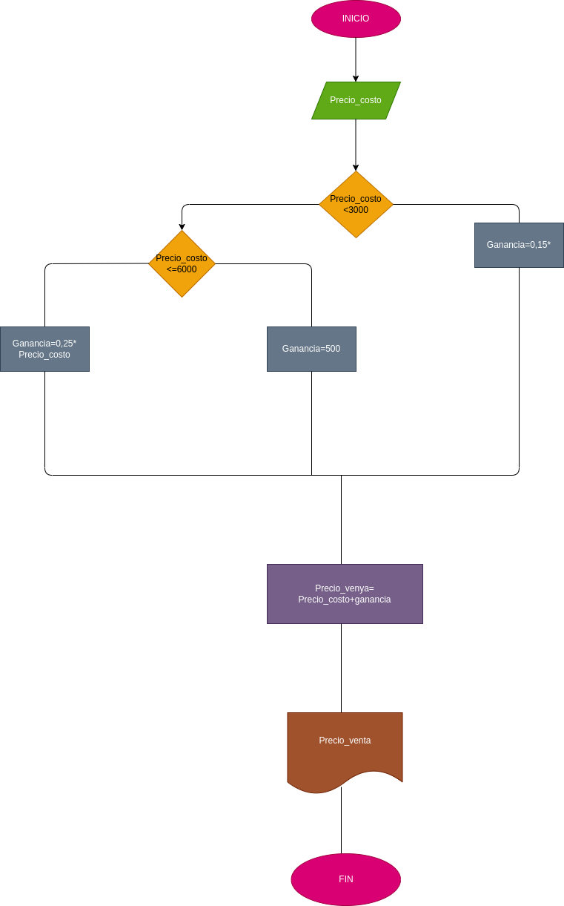

# Estructuras-condicionales
Programa que calcula el porcentaje de ganancia de ciertos productos dependiendo de su valor.

# ANÁLISIS
Variables de entrada y proceso (entrada, procesamiento)

Precio_costo: Necesario para sacar el porcentaje de los productos

variables de salida

Precio_costo<3000 Precio_costo< Ganancia=0,15 Precio_costo Ganancia=0,25 Precio_costo Ganancia=500 Precio_venta=Precio_costo+Ganancia

Nos indicará cual es el valor final de los productos.

# DISEÑO

# CONSTRUCCION
