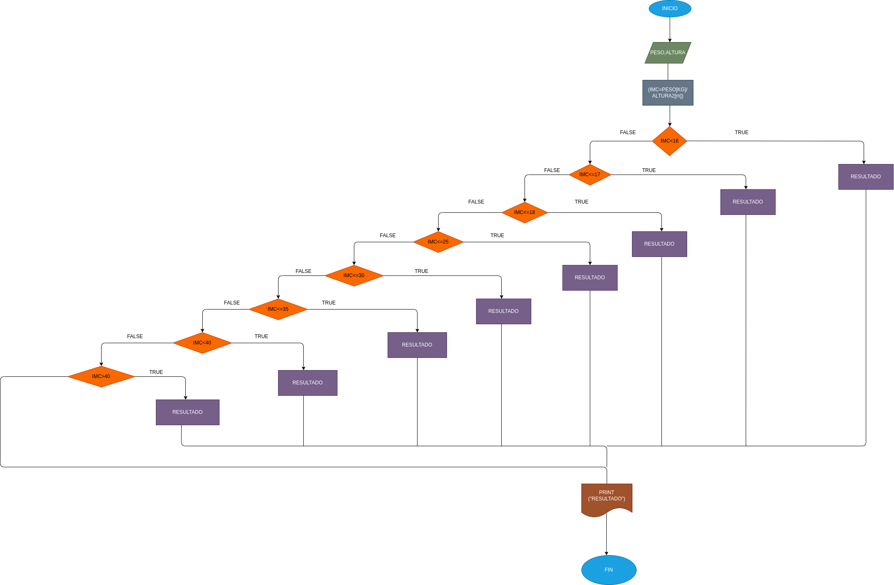

# caluclo peso
programa para saber la masa corporal de una persona

# ANALISIS
variables de entrada

peso

estatura

variables de proceso

masa corporal -dependiendo de la masa corporal se informara si la persona esta en criterio de ingresoen hospital, infrapeso, bajo peso, peso normal, sobrepeso, obesidad grado I, obesidad grado II, obesidad grado III, obesidad grado IV

variables de salida esta saludable o no

# DISEÑO

# CONSTRUCCION 