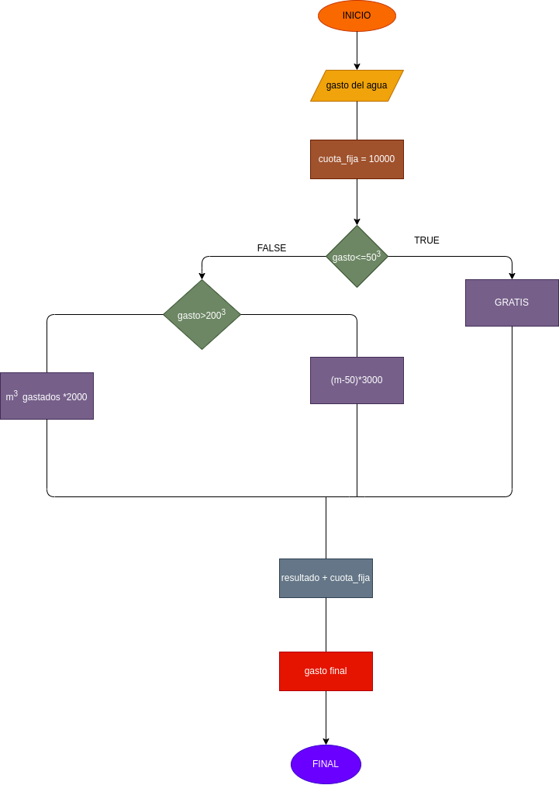

# gasto_agua
programa para calcular cuanto tiene que pagar al mes por la cantidad de agua que gasta

# ANLISIS
variables de entrada

cantidad de agua que gasta
variables de proceso

cuota fija = $10000
si es mas de 50 m3, se cobra 2000 por cada m3 adicional -si es mas de 200 m3, se cobra 3000 por cada m3 adicional
variables de salida

cantidad a pagar
# DISEÑO

# CONSTRUCCION