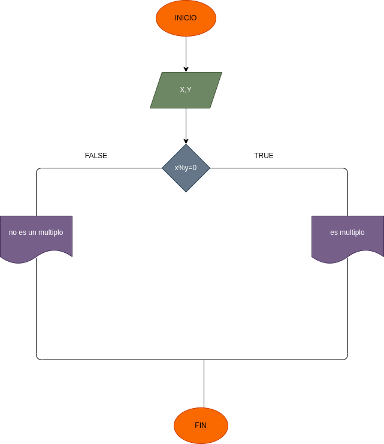

# dos numeros son multiplos
programa para averiguar si dos numeros son multiplos

# ANÁLISIS
variables de entrada

X
Y
variables de proceso -si X se divide en Y, y es entero, entonces X es multiplo de Y -si X se divide en Y, y no es entero, entonces X no es multiplo de Y

variables de salida

X es multiplo de Y
X no es multiplo de Y
# DISEÑO

# CONSTRUCCION